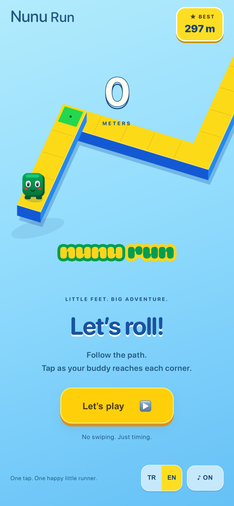
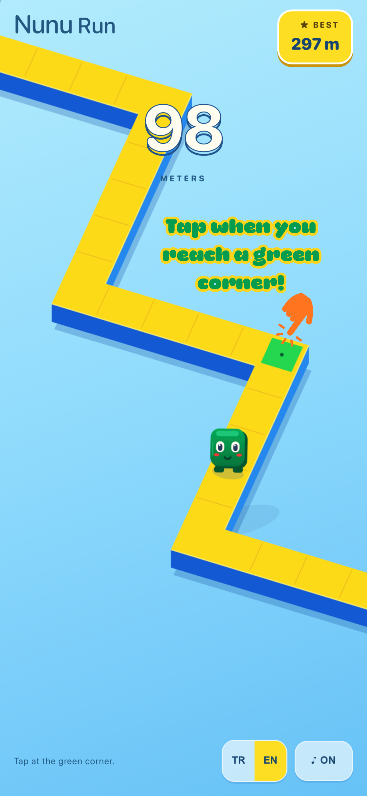
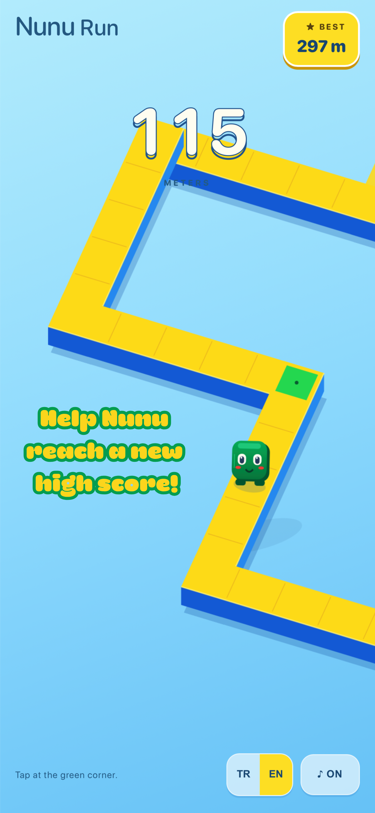

# Nunu Run

**One-touch endless runner for iOS**

Nunu Run is a fast, colorful one-touch mobile game built from prototype to App Store submission. The player taps at the right moment to help Nunu turn at corners, stay on the path, and survive as the game gradually speeds up.

## Showcase

  
  
  

## Product Highlights

- One-touch 90° turning mechanic
- Procedural endless gameplay
- Progressive speed and difficulty
- First-time interactive tutorial
- Turkish and English localization
- Persistent high score and settings
- Music and sound controls
- Native iOS packaging
- Interstitial monetization flow
- Consent-aware ad setup for supported regions

## Tech Stack

`JavaScript` · `Vite` · `Capacitor` · `iOS` · `AdMob` · `Google UMP`

## From Prototype to App Store

The project was taken through a complete mobile product and release workflow, including:

- gameplay concept and rapid prototyping
- iterative difficulty and interaction tuning
- native iOS packaging with Capacitor
- physical-device QA and lifecycle testing
- TestFlight distribution
- App Store metadata, privacy, age-rating, and review preparation
- AdMob production setup
- Google User Messaging Platform consent flow
- localization and release hardening

## Current Status

**App Store Review — Waiting for Review**

The public App Store link will be added after release.

## Developer Website

https://ozankazbas.github.io

---

This repository is a public project showcase. The production game source code is kept private.
